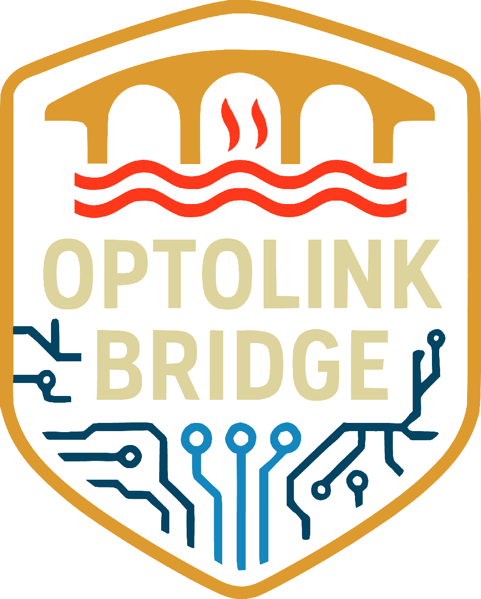
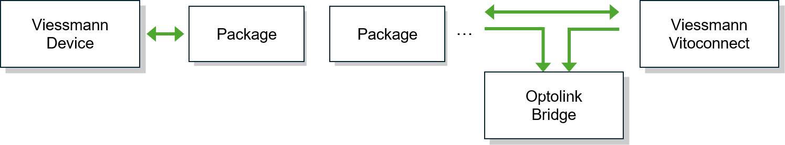
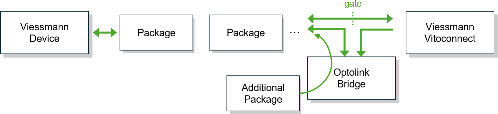
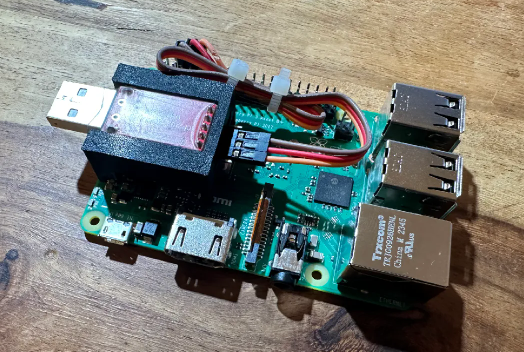
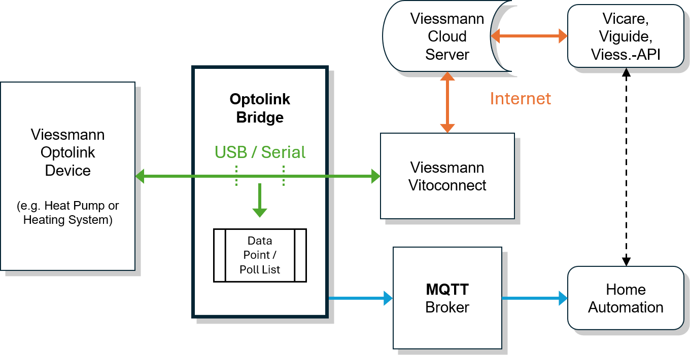

<p>

# **Optolink Bridge**

__Safely bridge the Optolink bus of your Viessmann heating system and publish attributes via MQTT + Home Assistant Device Discovery.__

> [!IMPORTANT]
> Neither this project, nor its author(s) have any affiliation with Viessmann (Group GmbH & Co. KG), its products, or subsidiaries in any way, shape, or form. The terms Optolink, Vitoconnect, Vitocal, Vitotronic, ViCare, etc. refer to Viessmann products and technologies. The projects efforts have been solely achieved through reverse engineering. No warranty or guarantee can be given or provided. Use this project entirely at your own risk. There is no financial or commercial interest behind this work.

> [!NOTE]
> You want local access to your ViCare thermostats / climate sensors as well? Check out [ViLocal](https://github.com/kristian/ViLocal#readme) for internet-free access to your ViCare components.

## Table of Contents

- [Key Benefits](#key-benefits)
- [Introduction](#introduction)
- [Set-Up and Installation](#set-up-and-installation)
- [Analyzing Optolink Traffic](#analyzing-optolink-traffic)
- [Frequently Asked Questions (FAQ)](#frequently-asked-questions-faq)
- [Author](#author)
- [Bugs](#bugs)
- [License](#license)

## Key Benefits

- **It's Safe & Fully Transparent** – One of the upmost goals in the development of the Optolink Bridge was to not interfere with any of the inner workings of your heating system. Optolink Bridge achieves this by not interacting / mangling with any communication coming from / going to your heating system, but passing all data along 1:1, as quickly as possible. This makes Optolink Bridge by design very safe to use.

- **Fast and Reliable** – In order to fulfil the promise of the first bullet point, it was important that the full speed of the Optolink bus is preserved. The internal design of Optolink Bridge is based on multiple fully asynchronous queues. Meaning traffic of the Optolink interface is first and foremost forwarded in so called [`PassThrough`](https://nodejs.org/api/stream.html#class-streampassthrough) streams (in both directions). This guarantees that neither your heating system, nor Vitoconnect is able to differentiate between being directly connected to your heating system or not, as the full bandwidth of the 4,800 baud serial interface (about 20-25 packets per second) stays available. Any processing of the data (e.g. forwarding it to MQTT) then happens in a fully decoupled queue.

- **Analyzing Capabilities** – As Optolink Bridge monitors the communication between your Vitoconnect and Viessmann heating system, it provides you with full insight what data is being exchanged and comes with built-in tools for analyzing the traffic.

- **Viessmann Heating/Heat Pump Compatibility** – Works with Vitodens, Vitocal, Vitocrossal and most other Optolink featured devices that "talk" the VS2 protocol.

- **Smart Home Ready** – Integrates with Home Assistant, ioBroker, Node-RED or any other system through MQTT and Home Assistant Device Discovery.

## Introduction

Optolink Bridge is a fully local, non-cloud, non-vendor specific solution, to capture and record attributes of your Viessmann heating system / heat pump. Viessmann provides a connectivity module called Vitoconnect, that can be connected to your heating system via a infrared (IR)-based bus, called "Optolink". Vitoconnect then starts pulling information from your heating system, like the current sensor temperatures, settings, etc. Optolink Bridge is able to monitor this communication, in order for you to consume the information about transmitted attributes elsewhere via the MQTT protocol. For instance in your home automation solution, like ioBroker or Home Assistant. As Optolink Bridge by default only watches over the communication, without interfering with the contents or timing of the serial connection, it acts fully transparent towards your Vitoconnect and heating system. Both essentially have no way of knowing if a Optolink Bridge is connected. As Optolink Bridge gains full knowledge about the data transmitted, read messages can be injected, in order to pull out even more information than the Vitoconnect already does.

Before we continue, let us address an elephant in the room: What about Phil's [Optolink Splitter](https://github.com/philippoo66/optolink-splitter)? For a more detailed answer check out the [FAQ section](#frequently-asked-questions-faq) section, but in a nutshell: Both projects share the same goal & purpose and Optolink Bridge's main inspiration was indeed Phil's Optolink Splitter. However while Phil's tool focusses on also working stand-alone (so without a connected Vitoconnect), Optolink Bridge is optimized for the interaction with a Vitoconnect in place. Instead of sending own requests to the Optolink bus, Optolink Bridge first and foremost monitors the communication between your Vitoconnect and heating system / heat pump and publishes attributes transmitted via the Optolink interface via MQTT. This means the underlying concept of Optolink Bridge is different, to what Optolink Splitter does and users should choose between either project, depending on their use-case and requirements.

### Operation Modes

Optolink Bridge features two distinct operation modes called **"pass-through"** and **"intercept"**. Depending on your requirements you can choose either operation mode to capture attributes of the Optolink interface to your heating system:

- **Pass-through Mode**: This is the default and least intrusive operation mode Optolink Bridge offers and the original namesake of the project. In pass-though mode Optolink Bridge utilizes Node.js [`PassThrough`](https://nodejs.org/api/stream.html#class-streampassthrough) streams, which by design forward all traffic sent by or received from the Optolink interface 1:1. The pass-through option then "listens" to the traffic, in order to publish the attributes recorded. This on the one hand side guarantees an upmost level of security in operation, as the underlying devices have no way to recognize that Optolink Bridge is acting as a "(wo)man-in-the-middle". On the other hand, both the bandwidth and timing of the serial interface is kept nearly indistinguishable close, compared to directly connecting the Optolink interface to your Vitoconnect:

   <p>

   This is the default operation mode Optolink Bridge starts in, with the only downside being, that no additional attributes can be read from the Optolink interface. Meaning you are stuck to the (arguably plenty) of attributes Vitoconnect already reads. You have to be the judge, if for your use-case this limitation suffices. It often depends on your heating system / heat pump and / or ViCare subscription, which attributes are being read. As a rule of thumb everything visible in your ViCare app, as well as quite some additional attributes are already exchanged by Vitoconnect.

- **Intercept Mode**: The second, more powerful, but also more intrusive operation mode, is called the "intercept" mode. Instead of using `PassThrough` streams, to forward, intercept mode utilizes the more general [`Transform`](https://nodejs.org/api/stream.html#class-streamtransform) stream. `PassThrough` being the most trivial implementation of a `Transform` stream (passing data through 1:1), implementing a `Transform` stream allows Optolink Bridge, to now also interfere with the data, if needed. Note that even in intercept mode, Optolink will *never* modify / change data being sent from your devices. Data is always forwarded 1:1, however using a `Transform` stream allows to halt stream processing at specific points in time and inject own messages if needed. This results in Optolink Bridge being able to query / poll for own attributes, in addition to the ones already requested by the normal Vitoconnect traffic. Optolink Bridge is only interfering with the traffic if needed (i.e. an attribute is read), in "normal operation" intercept mode much behaves like the pass-through mode before:

   <p>

   Generally the only two downsides of this second mode is, that it slightly reduces the overall bandwidth of the Optolink bus (which is generally quite slow with only 4,800 bauds / bytes, or about 20-25 packets per second) and that a little more processing is required, in order to determine when it is safe to inject a message. Both operation modes are built based on the same premise: Full-speed / baud rate and safe transmission, however due to the fact that we are only able to intercept the Optolink traffic at certain points in time, only pass-through mode processes the packets fully asynchronously, while intercept mode has to watch the traffic more actively and parse the packets that are pulled from Optolink during stream processing. It's still a very efficient and safe approach, however a little less secure by nature of the design and what we are trying to achieve. As a major upside, Optolink Bridge is also able to read attributes that are normally not read by your Vitoconnect in intercept mode.

The general recommendation is to start using Optolink Bridge in pass-through mode and only switch to intercept mode, in case you have to read attributes, that Vitoconnect doesn't. Optolink Bridge will automatically switch to intercept mode, as soon as you define items / addresses to pull. If no `pull_items` are specified in the `config.toml`, Optolink Bridge will start in pass-through mode by default.

## Set-Up and Installation

Optolink Bridge essentially runs on the very same hardware requirements as the the [Optolink Splitter](https://github.com/philippoo66/optolink-splitter?tab=readme-ov-file#desktop_computerhardware-requirements). This decision was taken on purpose, in order to make switching back and forth between both projects as seamless and easy as possible, again depending on your current requirements. The only obvious but major difference is, that Optolink Bridge *requires* a Vitoconnect to be connected, Optolink Splitter is able to run in "standalone mode", so without a Vitoconnect connected. One other noteworthy change is that whilst Optolink Splitter was developed in Python and relies on de-/encoding every message, Optolink Bridge was developed using Node.js's asynchronous streaming concept. Also messages will never be re-encoded in order to be sent to the Optolink bus. The communication is always "as is" received from the connected devices. Optolink Bridge acting as a transparent proxy.

As Optolink Bridge works mainly by monitoring the existing Vitoconnect traffic, one key difference to the hardware requirements is that a USB-to-TTL adapter (like a CP2102 / FTDI board) and a Vitoconnect are considered *mandatory*, as Optolink Bridge in contrast to Optolink Splitter *does not* sent its own communication down the Optolink interface for synchronization. Thus the hardware requirements are:

### Hardware Requirements

- Raspberry Pi or a suitable system.
- Viessmann Optolink-compatible heating / heat pump (Vitodens, Vitocal, Vitocrossal, etc.).
- Vitoconnect (or another Vito-component connecting to your Optolink interface).
- Optolink R/W head. If you own a Vitoconnect, you should already own a compatible USB R/W head.
- A USB-to-TTL adapter:
  - Recommended: CP2102 chip ([Example](https://www.google.com/search?q=cp2102+usb+ttl)).
  - Some newer Vitoconnect models may work with FTDI chips.

### Set-Up the Hardware

The hardware recommendation is the same as for the Optolink Splitter: A Raspberry Pi and a CP2102 chip USB-to-TTL breakout board. This is a step-by-step guide how to set it up:

1. Connect your CP2102 breakout board to the GPIO pins of your Rasperry Pi. You can find an overview of the GPIO pins of your Raspberry Pi [here](https://www.elektronik-kompendium.de/sites/raspberry-pi/2002191.htm). The pins should get connected as follows:

    | Raspberry Pi | CP2102 |
    |--------------|--------|
    | 6 (GND)      | GND    |
    | 8 (TXD)      | RXD    |
    | 10 (RXD)     | TXD    |

    Notice how the TX / RX lines are *crossed-over*! Also **do not** connect the +3V und +5V pins of your CP2102 breakout board to / from the Raspberry Pi! They are not required and will start "battling" the power supply voltage. This is how it should look like:

    

2. Plug-in your existing Optolink R/W head cable to any of the existing USB ports of the Raspberry Pi. The CP2102 breakout board USB header can then be plugged in directly to your Vitoconnect or connected via a USB extension cord.

3. Follow the instructions [here](https://github.com/philippoo66/optolink-splitter/wiki/050-Prepare:-enable-serial-port,-disable-serial-console) to enable your Raspberry Pi's serial port and disable the serial console. In a nutshell run:

    ```bash
    sudo raspi-config
    ```

    Then goto `3 Interface Option`, `6 Serial Port`, when prompted for `Would you like a login shell to be accessible over serial?` respond with *No*, and answer `Would you like the serial port hardware to be enabled?` with a `Yes`.

4. In case you are using a Raspberry Pi 3+ / 4, it is likely necessary to use the `ttyAMA0` instead of the `ttyS0` port as your Vitoconnect port. However `ttyAMA0` is by default bound to your bluetooth interface, so you need to unbind it first:

   ```bash
   # /boot/config.txt on older releases of Raspberry Pi OS
   sudo nano /boot/firmware/config.txt
   ```

   Add `dtoverlay=disable-bt` at the bottom of the file and reboot your Raspberry Pi. On newer Raspberry Pi 4 models, this changes to `dtoverlay=pi3-miniuart-bt`.

5. Optional, if you own a 3D printer, print a [neat case](https://www.printables.com/model/1144565-raspberry-pi-3-b-4-sleeve-case-w-cp2102-holder-wal) for holding your Raspberry Pi and CP2102 breakout board.

Congratulations you are set-up for using Optolink Bridge (and Optolink Splitter, if you ever device to switch).

### Install the Software

#### 0. Install Node.js

As a prerequisite Optolink Bridge is based on Node.js, thus we recommend downloading the latest long term release (LTS) of Node.js:

```bash
sudo apt-get install -y curl
curl -fsSL https://deb.nodesource.com/setup_22.x -o nodesource_setup.sh
sudo -E bash nodesource_setup.sh
sudo apt-get install -y nodejs
node -v
```

#### 1. Clone / Download the Repository

```bash
git clone https://github.com/kristian/optolink-bridge.git
# or
curl -fsSL https://github.com/kristian/optolink-bridge/archive/refs/heads/main.zip -o optolink-bridge.zip
unzip optolink-bridge.zip

cd optolink-bridge
```

#### 2. Enable `corepack` & Install Dependencies

```bash
corepack enable
yarn install
```

#### 3. Configure MQTT & Data Points / Poll Items

Edit [`config.toml`](config.toml) (or copy the file to a `local_config.toml`, if you cloned the repository and want to keep it out of your Git history). Refer to the documentation / comments in the configuration file as a reference. Some configuration hints:

- If you are using a Raspberry Pi, make sure you enabled the serial interface, as described in the [hardware set-up section](#set-up-the-hardware).
- In case you are using a Raspberry Pi 3+ / 4, make sure to set the `port_vito` to `ttyAMA0` (after disabling your bluetooth interface) instead of `ttyS0`.
- Specify all data point definitions in the `data_points`, this includes data points that should be parsed in pass-through mode, as well as items / addresses that are specified in the `poll_items` list. Note that you may want to utilize the [`tools/convert_data_points.js`](./tools/convert_data_points.js) tool, to create a initial / full list of your heating systems data points. Alternatively, in case you already have a list for Optolink Splitter, you may use the [`tools/convert_poll_items.js`](./tools/convert_poll_items.js) tool, to convert the `poll_items` Python array into a TOML format.
- Optolink Bridge will start in pass-through mode in case no `poll_items` are defined and in intercept mode, in case at least one item to poll is specified. See [operation modes](#operation-modes) for more details.
- Some fields, like the `log_level`, `data_points` array and `poll_items` list will be reloaded during runtime. This allows you to tweak your data points / poll items, without interrupting your heating systems Optolink communication, which sometimes throws of Vitoconnect / ViCare. Also changes to the `log_level` allow you to turn on tracing for a short period of time, in order to [analyze the Optolink traffic](#analyzing-optolink-traffic).
- Make sure you specify the right credentials to your MQTT broker, for the data points to get published. In case you are using Home Assistant Optolink Bridge will by default publish all data points via [Home Assistant MQTT Device Discovery](https://www.home-assistant.io/integrations/mqtt/#mqtt-discovery). In case you do not require publishing the device discovery record, feel free to disable it in the configuration.

#### 4. Get Started

After you specified the configuration and in order to get started, run Optolink Bridge with the following command:

```bash
yarn run start
```

You should see data start flowing to your MQTT broker.

#### 5. Optional: Set-Up Optolink Bridge as a service

Create a `systemd` service file:

```bash
sudo nano /etc/systemd/system/optolink-bridge.service
```

Make sure you adapt the user to your home directory:

```
[Unit]
Description=optolink-bridge
After=network.target
Wants=network.target

[Service]
Type=exec
User=root
WorkingDirectory=/home/user/optolink-bridge
StandardOutput=null
StandardError=journal
ExecStart=/usr/bin/yarn run start
Restart=on-failure

[Install]
WantedBy=multi-user.target
```

Reload your `systemd` daemon:

```bash
sudo systemctl daemon-reload
```

To enable the service / start it when your Raspberry Pi starts:

```bash
sudo systemctl enable optolink-bridge.service
```

Start the service with:

```bash
sudo systemctl start optolink-bridge.service
```

Check the status:

```bash
sudo systemctl status optolink-bridge.service
```

## Analyzing Optolink Traffic

The traffic on the Optolink bus that Vitoconnect sends is usually quite noisy. Vitoconnect essentially tries to max out the 4,800 serial bus baud rate, resulting in 20-30 packets sent per second.

Analyzing the traffic, to find addresses that are maybe not yet exposed via any data point lists, or to get a better understanding of what certain data points are about, is crucial for getting an understanding of your heating system. From previous attempts to analyze the traffic that Vitoconnect sends via the Optolink bus, there is the general observation that Vitoconnects reads / writes and perform a lot of remote procedure calls to addresses, that are not exposed to any externally available data point list (yet).

Optolink Bridge allows you to enable trace logging, essentially tracing each and every request / response send via the Optolink interface. These generated trace files can then be used to start digging into the communication without having to just look at the (mostly overwhelming amount of) raw data, with the provided analysis tools.

### Tracing Addresses by Example

Let's try to find an address, that currently is not (knowingly) exposed in any data point list. I own a Vitocal 200-S with a Vitotronic 200 (Typ WO1C), a split heat-pump system. For this system I would like to know the so called "compressor phase". In the Viessmann app, I see that there should be an attribute / address with essentially four values: "off" (I assume `0x00`), "heating", "pause" and "preparing". Looking into the data point lists on the internet, I haven't found a matching attribute. In one data point list on openv I found a attribute called "V1AppState" with address `0x0E1A` which seems to match, but it doesn't seem that Vitoconenct is using that attribute, but another attribute instead, that I now need to find. Lets try to dig down to tracing, in order to find the right address.

#### Step 1: Start with the Data Point List of your heating system

As a first step, I always recommend to start with the publicly available data point list of your heating system. It provides you with a basic understanding of your heating system and maybe already gives you an idea where to look for. E.g. maybe the address you are looking for *is* part of the list, however named in a way that you don't recognize it to be, or even if it isn't part of the list yet, you can narrow it down to only analyze the attributes that have no data point associated yet.

In order to be finding the right data point list, you first need to identify your device. Have a look into [this list of devices by Viessmann](docs/device_list.pdf). We are interested in the column named "Geräte-ID". You can either locate the right line from the type label on your heating system, or read the `0x00F8` address, that outputs the "ZE'ID" / device id column in the device list. In my case, the device ID of my heating system is "CU401B_S". From the [ViesData GitHub](https://github.com/philippoo66/ViessData21/blob/master/DP_Listen_2.zip) download and extract the `DP_Listen_2.zip` to find a `.txt` file matching the device ID, so in my case `CU401B_S.txt`. Please also have a look into the [ViessData instructions](https://github.com/philippoo66/ViessData21/blob/master/README.md#datapoints_readme) on how to identify your device, as well as the [(German) instruction](https://github.com/openv/openv/wiki/Ger%C3%A4te) on the OpenV Wiki.

In order to convert the addresses / registers (there are a LOT!) into data point addresses for your `config.toml` file, you can use the `convert_data_points.js` script. In my case I run:

```bash
yarn node tools/convert_data_points.js CU401B_S.txt
```

This should output a list of data points, that you can paste into your `config.toml` and get started tracing values. Note that you can change / adapt the data points in your configuration file at any point in time during trace analysis. Actually the tracing part itself (so where Optolink Bridge records traffic) is not influenced by the data points in the configuration file, only the analysis is taking them into account. Meaning you can make changes and see if it had a positive / the desired affect on your analysis / parsing. Only later, if you start recording data with Optolink Bridge to MQTT for example, the correct definition data points becomes mandatory.

#### Step 2: Trace data into a trace file

Next up comes the data recording part. In order to perform the analysis we need what is called a trace file. A trace file records all the raw traffic your Vitoconnect sends to your heating system. It also adds some meta information like a timestamp and the direction the data was flowing. The analysis tool works with just the raw data, however having the additional meta information available helps to analyze the traffic. In order to record such a trace file, just set the `log_level` in your `config.toml` file to `trace`, then restart `optolink-bridge` using the usual command, piping into a trace file:

```bash
yarn run start > out.trace
```

This will record all standard output into `out.trace`. Now we just need to wait. The more data the better, but most importantly, check that the attribute / address that you are trying to find had some transitions. E.g. in my case, as I want to find the attribute for the compressor state. I watched the app after starting the trace recording, checking if there at least have been some transitions, even though we don't know what values the state transitions record yet. Just that you get an idea about what values to expect and a rough idea how often / at which times the values did change.

#### Step 3: Start analyzing the trace file

After we recorded some traffic and are sure a couple of state transitions of the attribute we are looking for have been recorded, we can start analyzing the trace file. This is done with the `analyze_trace.js` tool. The tool accepts the name of the trace file as an argument, so start the analysis with:

```bash
yarn node tools/analyze_trace.js out.trace
```

The analysis will statistically evaluate the provided trace file and output all addresses recorded in a structured manner, in order to allow for an easier evaluation. In order to narrow down the noisy data, the analysis will first categorize all recorded packets that contained values into the following types:

- **Mostly identical data**: Addresses that contained only a certain set of values. This is where you will find addresses containing enumeration or state variables, e.g. if a variable toggles between on `0x01` and `0x00` off, you will find it in this section. Note that in case you recorded a small time frame, many variables will appear here, because if say a numerical value was recorded and it only contained three different numbers, it will still be listed here. So make sure you trace for a long enough time frame. This section is great to find stuff like the before mentioned compressor state.

- **Mostly variable data**: Addresses that contained mostly variable values. This is the section that contains everything that had many changes to it's data, for example a number that grows, or statistical values, e.g. if the heating system reports the runtime of a certain component it will grow from say `0x012`, to `0x013`, ... to `0x021`, so this address will appear in this section.

- **Data that never changed**: Addresses that always contained the same / identical value over the recorded trace period. This likely corresponds to stuff like configurations, however depending on the time frame recorded, could also list state values, that simply didn't change over the recorded time frame. This section is great for finding configuration, such as for example if your heating system has a certain component enabled, or similar. Also this is a great opportunity to check for configurations that can be manually changed, e.g. via the ViCare app: Run a trace, to record every configuration that is not changed. Then start another trace into a new file, now wait for a couple of minutes, so the trace records the old value again, change the configuration e.g. via the app, stop the trace and see if a address, that was previously in this section, moved to one of the previous sections.

- **Complex data / arrays / strings**: A special section was added to list recorded addresses that contained complex data types, so byte arrays with more than 10 bytes. These addresses often contain either strings e.g. the name of your heating system, or other complex types such as arrays, e.g. the holiday program configuration of your heating system. In order to not record all these long arrays of data as "variable data" or clutter the other sections with them, they appear in an own section.

- **No data**: If there is addresses that had been only read / written to without any data (e.g. remote procedure calls without parameter or a return value), they will appear here

These sections are already a great tool to narrow down your search for the right attribute. E.g. in case you expect an enum, look into the mostly identical data section. Or apply a strategy to locate the attribute, as explained in the data that never changed type. For each section the analysis report will then list:

1. All addresses that already had a data point configured. So in case you already imported a data point list, as described in step 1, or you had attributes configured, that you wanted to evaluate if they are being evaluated correctly, you can check this section. Also it is always worth to scan for addresses / data points, that maybe fit into the category you are looking for, however have maybe a name, that you didn't expect. For example the mentioned search for the compressor state variable, this section contained a address `0x130b` labeled "WPR_Zustandsautomat_WP2" (so state machine WP2) in the data point list, which contained some promising information. As a data point is configured, the analysis tool will already output the data in the configured data type listed in the data point configuration.

2. All addresses that do not have a data point configured yet, so net new addresses. This list is a little more unstructured, as it contains the hex / raw values for each attribute, however even before importing the data point list, the `0x130b` immediately looked promising, as it appeared in the "mostly identical data" section, which is where I was expecting the compressor state to be in.

The report then finally prints out all values over time they appear in the trace. Here is an explanation of the different visualizations of the individual sections:

- **Mostly identical data** will be printed as a condensed list of values over time. Meaning data will only get printed if changed and a number in between the elements indicates, how many times the same value was traced, for example:

   ```
   960× 0x130b: 0x00, [34× …], 0x01, [1× …], 0x02, [35× …], 0x03, [12× …], 0x00, [175× …], 0x01, [1× …], 0x02, [31× …], 0x03, [13× …], 0x00, [135× …], 0x01, [2× …], …
   ```

   Means that 960 trace lines contained information about address `0x130b`, it started with `0x00`, then after 34 `0x00` it toggled to 0x01, toggled to `0x02` shortly after and so on. The ellipsis (…) at the end indicates, that the trace files contained even more elements, that have been shortened.

- **Mostly variable data** will be printed, while filtering out identical values, without showing how often the data didn't change. For variable data, like statistics adding the number of times the value did not change makes not much sense, as essentially every mention would just show 1×, 2×, etc. taking up valuable analysis room. This is an example of a mostly variable data record:

   ```
   736× 0x01c6 (rucklauftemperatur): 37, […], 36.9, […], 36.800…, […], 36.7, […], 36.6, […], 36.5, […], 36.4, […], 36.5, […], 36.6, […], 36.7, …
   ```

   736 trace lines of address `0x01c6` have been recorded. Address `0x01c6` already had a configured data point "rucklauftemperatur" (so return temperature) that started at 37, changed to 36.9, 36.8, etc. The smaller … at the end of each number mean that the decimal contained even more (trimmed) decimal places, e.g. 36.800…, the … at the end again indicating that there have been even more values traced. This is a great way to validate that some of your data points contain the expected data.

- **Identical data** will just be visualized by printing the one value recorded, for example:

   ```
   960× 0x1306 (zustandsautomat_pm_sc1): 480× 0x00
   ```

- **Strings / arrays / complex data** will just show one (the first) example found in the trace, e.g.:

   ```
   29248× 0xa800: e.g. 0x00 → 0x000000000000000000
   ```

   This is to not overflow the analysis with string data. Something you would be able to see in any section, however mostly appears in this section, is data as you see it above, Notice the little arrow →? This is a remote procedure call (RPC) recorded, so a function was called on address 0xa800 with an input parameter `0x00` and the result was (in this case) an empty string `0x000000000000000000`. For a more detailed analysis of this attribute, refer to the next section of this guide.

- **No data** addresses will just print the address and how often it has been traced:

  ```
  124× 0x0000
  ```

One more notation you will be able to spot in the data is the (!) notation, that is displayed after some of the values:

```
964× 0x2007 (hkl_neigung): 1.5, [136× …], 1.6 (!), [21× …], 1.5 (!), [322× …]
```

The (!) denotes a "write" operation performed by the Vitoconnect, so in the example above, the `hkl_neigung` attribute has been read once and then Vitoconnect takes over writing the changed / adapted / dynamic values over time. The categorization and visualization allows you to perform an in-depth analysis of the Vitoconnect traffic via Optolink and surely will allow you to narrow down what you are looking for, to a couple of addresses that look like they could contain the data you are trying to find.

#### Step 4: Detailed analysis of a single address

To now go and validate the candidates that you identified in the previous steps, you can take a closer look at them. In order to do so, again run the analysis script, but this time, pass the address that you want to analyze in detail, as a second parameter, e.g.:

```bash
yarn node tools/analyze_trace.js out.trace 0x130b
```

This will filter the output by just the single address. You can also add more addresses as further parameters, this is helpful in order to analyze for addresses that might correlate to each other. Invoking the analysis script this second way, will output a different style of report:

```
2025-02-25 15:28:55.779 0x130b (READ): 0x00 (debug: {"uint8":0,"int8":0,"string":"\u0000","buffer":"0x00"})
… 34× identical value(s) …
2025-02-25 15:55:09.873 0x130b (READ): 0x01 (debug: {"uint8":1,"int8":1,"string":"\u0001","buffer":"0x01"})
… 1× identical value(s) …
2025-02-25 15:56:40.858 0x130b (READ): 0x02 (debug: {"uint8":2,"int8":2,"string":"\u0002","buffer":"0x02"})
```

Instead of just listing a couple of values, it will go through the whole trace file, listing every found address / communication with data associated. It will log the time the address was recorded, how many times the same / identical values was recorded. This is great to perform an analysis, to when a given value changed, or how long it stayed. You can for example correlate this with the data visible in your ViCare app, e.g. when the compressor turned on / off or went to pause.

In addition you will get information about whether the data was recorded in a read or write operation. Data types that are analyzed that do not have a configured data point, will (in addition to the raw / hex) output also show a "debug" print, so they will be converted into fitting data points. E.g. in the example above, the data contained a single byte, which could correspond to a single byte raw / buffer, a single character string, or a `(u)int8`, which are printed as reference. This is helpful in order to find if the data really contains for instance the expected statistical values.

With the general trace analysis and the single address analysis, you should be able to analyze your Vitoconnect traffic much more easily than by just looking at the raw data of the traced output.

## Frequently Asked Questions (FAQ)

### How is Optolink Bridge different to the well regarded [Optolink Splitter](https://github.com/philippoo66/optolink-splitter)?

Whilst the Optolink Bridge runs on the same hardware (a Raspberry Pi with an Optolink r/w head and a CP2102 breakout board), its concept and implementation differ fundamentally. The first distinction is that Optolink Bridge uses Node.js instead of Python. Node.js is built around an event loop and has a strong focus on asynchronous processing, which are core principles at the heart of Optolink Bridge. The biggest difference, however, lies in how the Optolink bus/interface is accessed:

### Similar idea, different concept and execution

Instead of interfering with the communication between the Vitoconnect and the Optolink interface of your heat pump/heating system—for example by decoding/encoding traffic or injecting packets with an intelligent queuing mechanism, Optolink Bridge simply observes the traffic already exchanged through the Optolink interface by your Vitoconnect. In this way, it acts more like an *outside observer* than a *man in the middle*. With this approach, existing vendor components (i.e. the Vitoconnect and your heat pump/heating system) remain unaware of any difference compared to a direct connection. The concept is simple: less "magic", leading to more stable operation and fewer concerns about disruptions in your heating system.

### Sounds good, but where's the catch?

Whilst the Optolink Splitter can operate without a Vitoconnect (since it sends its own read/write commands to the Optolink interface in a queued, timed sequence) the Optolink Bridge *requires* a Vitoconnect (or another device communicating with the Optolink interface) in order to listen to the packets exchanged. As its name suggests, Optolink Bridge is a listen-only solution, with the major advantage that it never interferes with the existing traffic on the Optolink bus.

The Vitoconnect, for example, continuously loops through and reads all attributes of your heat pump/heating system. Instead of injecting own read / write requests every other request from Vitoconnect and essentially building it's own request / response queue (as the Optolink Splitter does) the Optolink Bridge simply listens to and parses the packets the Vitoconnect is already sending (at least in "pass-through" mode). This provides the Optolink Bridge with a steady stream of attributes to publish to MQTT, just like the Optolink Splitter. Even if run in "intercept" mode (see the [operation modes](#operation-modes) section), Optolink Bridge follows a strict split, pausing the Vitoconnect queue at a suiting point in time, injecting its own read (not write!) request, waiting for a response, and then resuming the original queue. Also here the upmost goal was to not mangle with the original queue of Vitoconnect at all.

### Message flow explained

<p>

All packets, whether sent (e.g., from your Vitoconnect to the heating system/heat pump) or received (from the heat pump to the Vitoconnect), are first and foremost forwarded 1:1. Optolink Bridge accomplishes this through a bi-directional (aka in Node.js terms a `PassThrough` or `Transform`) stream between the serial interfaces. Only then, in a fully autonomous and encapsulated [async queue](https://caolan.github.io/async/v3/), are the raw and/or parsed packets processed and forwarded via MQTT. In case of an error within this autonomous queue, the original communication remains unaffected. This ensures that Optolink Bridge operates in the least intrusive way possible.

In contrast, the Optolink Splitter features a so-called *Polling List* approach, a list of items/register addresses that are actively polled at regular intervals through the Optolink interface. This approach requires detailed knowledge of the bus traffic, since the Optolink Splitter must build a queue and time the serial connection perfectly to inject its own read/write requests, and ensure normal processing of the connected devices. Essentially, for the Optolink Splitter, the connected devices will simply experience the baud rate of the serial interface as being slower.

### So how to decide which attributes to read?

Optolink Bridge's first feature is the ability to publish unparsed raw packets/register addresses received via the Optolink interface/bus to your MQTT broker. This enables external parsing of attributes and the discovery of previously unknown parameters or register addresses.

Building on the idea of the Optolink Splitter's *Polling List*, Optolink Bridge introduces a format-compatible *Data Point List*. After publishing the raw packets to the broker, the packets are inspected, parsed, and then published using the names and formats defined in the parsing list—exactly as the Optolink Splitter does. This makes Optolink Splitter and Optolink Bridge fully compatible with each other.

### What if some addresses are not already transferred regularly or at all?

Optolink Bridge features two distinct [Operation Modes](#operation-modes): The least intrusive *pass-through* mode uses a Node.js `PassThrough` stream and cannot interfere with the transmitted data at all. In this mode, you are limited to the attributes that the Vitoconnect sends and reads. If you require access to additional attributes, e.g. ones not read by your Vitoconnect, or attributes that are only read once at startup but you would like to retrieve regularly, you can switch Optolink Bridge to its second mode, the *intercept* mode. This mode is enabled by defining a *Poll Items* list *in addition* to the list of data points in the `config.toml` file. While the data point list defines the name / format of attributes at specific bus addresses, the polling items list specifies which addresses to read and at what intervals. This allows you to precisely control how often and in which interval each attribute is read. For details, refer to the respective configuration section of the `config.toml` file for a deeper understanding of the two concepts.

### What is Home Assistant MQTT Device Discovery and how is it configured?

Optolink Bridge fully supports publishing [Home Assistant MQTT Device Discovery](https://www.home-assistant.io/integrations/mqtt/#mqtt-discovery) payloads. By default, all `data_points` are automatically published as basic MQTT sensors, making them instantly available in Home Assistant without additional setup.

This behavior can be customized in the `config.toml` file by defining overrides under `[mqtt.device_discovery.overrides]`. Overrides allow you to adjust the discovery payload, e.g. setting device classes, icons, units, or disabling specific data points altogether. You can also change the entity platform by creating override sections for different types. For example, if you want to publish certain attributes as `binary_sensor` instead of `sensor`, simply define them under `[mqtt.device_discovery.overrides.binary_sensor]` and specify the corresponding attributes. This makes it possible to tailor the discovery output exactly to your Home Assistant setup Optolink Bridge also publishes a single device-level discovery payload, where you can configure attributes such as `serial_number`, `identifiers`, `name`, `model`, and `manufacturer`. If neither `identifiers` nor a `serial_number` is provided (and Vitoconnect does not send one), no device discovery payload will be published.

For full details on supported options, see comments in the `config.toml` section and refer to the [Home Assistant MQTT integration documentation](https://www.home-assistant.io/integrations/mqtt/).

### When to choose which? Aka Optolink Splitter vs. Optolink Bridge

As explained in the previous sections, you can freely switch between Optolink Splitter and Optolink Bridge at any time. Both projects run on the same hardware, share the same polling/parsing list format, and publish parsed attributes to MQTT in the same way. The choice essentially comes down to: 

- **No Vitoconnect available:** If you don't own a Vitoconnect and want to read/write attributes directly from/to your heat pump or heating system using an Optolink adapter, choose Optolink Splitter. Optolink Bridge is *not* able to actively poll items.

- **Need to write attributes/registers:** If you want to also write attributes or registers back to your heat pump—for example, to dynamically adjust heating parameters such as the heating curve—choose Optolink Splitter. Optolink Bridge, as its name suggests, is *not* able to write to the Optolink interface/bus.

- **Older VS1/KW protocol in use:** If your heating system still uses the older VS1/KW protocol instead of the newer VS2 protocol, check out the Optolink Splitter branch with VS1/KW support.

- **Access hidden or non-standard attributes:** If you want to read attributes/registers that the Vitoconnect does not normally query, either switch Optolink Bridge to *intercept* mode (by defining `poll_items` in the `config.toml` file) or use Optolink Splitter, which already intercepts all messages and is able to read / write any address at will.

So in case you are looking for a safe, fast, asynchronous, modern and more lightweight alternative to Optolink Splitter, feel free to give **Optolink Bridge** a try. Hope you will like it!

### Are we "in competition" with the Optolink Splitter project?

No, not at all—in fact, quite the opposite. In open source communities (and in society in general), there are always different approaches and opinions. There is never a true "one size fits all" solution. Personally, I felt that the way Optolink Splitter handled packets, wait times, and timings involved a bit too much "magic" for my taste, especially in a component that processes data from my heating system, which especially in the winter is one of the most critical components in my home. This is why I decided to create Optolink Bridge as an alternative to Phil's Optolink Splitter, without any bad blood involved.

As you might have already guessed, I successfully ran Phil's Optolink Splitter for quite some time and even contributed enhancements, such as improved poll list timing and a Raspberry Pi case design. My hope is that releasing this project strengthens the open-source community around Optolink / Viessmann, rather than splitting it. In fact, some parts of Optolink Bridge were directly inspired by Phil's input. For example, in one discussion he mentioned his wish to better understand Vitoconnect communication, since he expected many "hidden attributes" or values already being processed. With the new analysis capabilities of Optolink and an overall modularized design, I hope we as a community can dive deeper into the internal workings of our Viessmann heating systems and uncover their hidden possibilities.

To finish with a small analogy: I like to think of the two projects as siblings, Optolink Splitter being the bigger, stronger brother who sometimes pulls data by force, and Optolink Bridge being the more delicate sister who prefers to listen rather than interfere. In the end, though, we're all family!

Phil's contributions through Optolink Splitter, ViessData, OpenV, his collaboration with Viessmann, and much more, will always go far beyond what this single project can achieve. Optolink Bridge is simply another building block in the ecosystem of open source Viessmann projects, created in the hope of contributing to a more automated and efficient future.

## Author

Optolink Bridge by [Kristian Kraljić](https://kra.lc/).

## Bugs

Please file any questions / issues [on Github](https://github.com/kristian/optolink-bridge/issues).

## License

This library is licensed under the [Apache 2.0](LICENSE) license.
